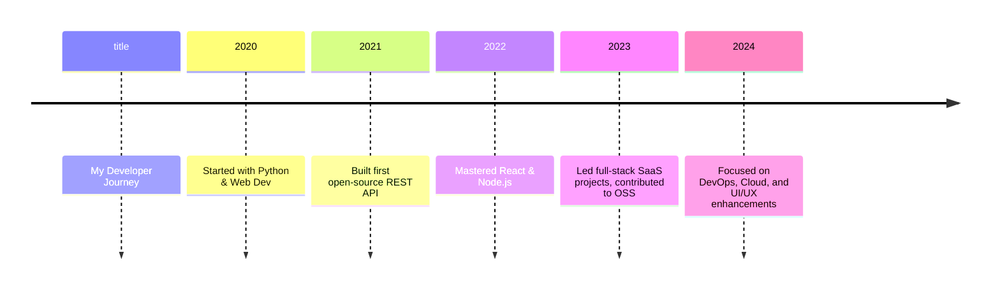

# 🚀 Prakash-codeMaker: Portfolio & Projects

---

## 📑 Table of Contents

- [About Me](#about-me)
- [Projects](#projects)
- [Technical Skills](#technical-skills)
- [GitHub Dynamic Stats](#github-dynamic-stats)
- [LeetCode & Kaggle Live Stats](#leetcode--kaggle-live-stats)
- [Citations / References](#citations--references)
- [Contact](#contact)

---

## 🧑‍💻 About Me

Hi! I'm **Prakash-codeMaker**, 
a results-driven developer specializing in crafting impactful, scalable solutions for modern problems.

> 👔 **For Recruiters:**  
Fast learner | Collaborative | Delivers reliable, production-grade code.

⏳ **Tech Timeline:**

---

## 🛠️ Projects

### Featured

| Project                       | Summary                        | Tech           | Link                                        |
|-------------------------------|--------------------------------|----------------|---------------------------------------------|
|         | AI-powered search assistant    | Python, GPT    | [See Repo](https://github.com/link1)        |
|         | Real-time chat platform        | React/Firebase | [See Demo](https://link.to.demo)            |
|         | Automated CI/CD pipeline tool  | Node.js, Docker | [See Repo](https://github.com/link3)       |

> _Browse all [my repos](https://github.com/Prakash-codeMaker?tab=repositories)_

---

## 🌟 Technical Skills

[More...](#)

---

## 🧑‍💻 GitHub Dynamic Stats

  <!-- GitHub Stats Card (dynamic) -->
  
  <!-- GitHub Streak -->
   
  
  <!-- Top Languages -->
   
  
   
  <!-- Custom Repo Count Badge (dynamic) -->
  
  <!-- Commits Badge / Info -->
  
   
  
  
   
  🔁 Stats are dynamic and update with your GitHub activity! For commit history, visit <a href="https://github.com/search?q=author:Prakash-codeMaker&sort=author-date&order=desc&type=commits">this link</a>.

---

## 📊 LeetCode & Kaggle Live Stats

  
   
  
   
  
   
  

---

## 📚 Citations & References

- “Prakash was instrumental in automating our deployment process…” — *Former Team Lead*, [LinkedIn Recommendation](https://linkedin.com/in/prakash-chand-jain-coder015675328)
- [Dev.to Article: Optimizing API Performance](https://dev.to/your-article-url)
- Research: [Scalable Microservices in Cloud](https://arxiv.org/abs/xxxx.xxxx)

---

## 📫 Contact

---

### 📄 Download My Resume

