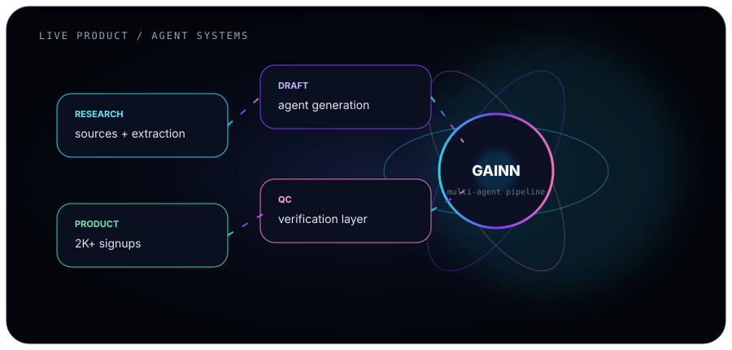
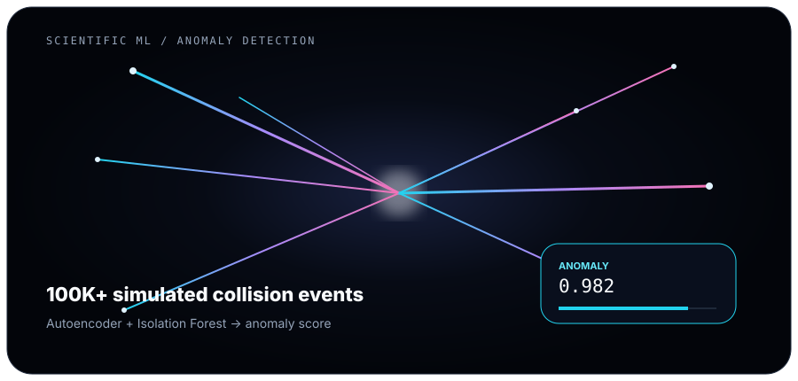
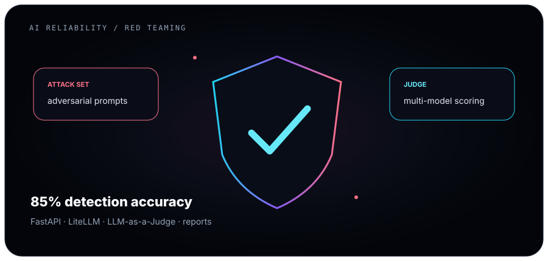
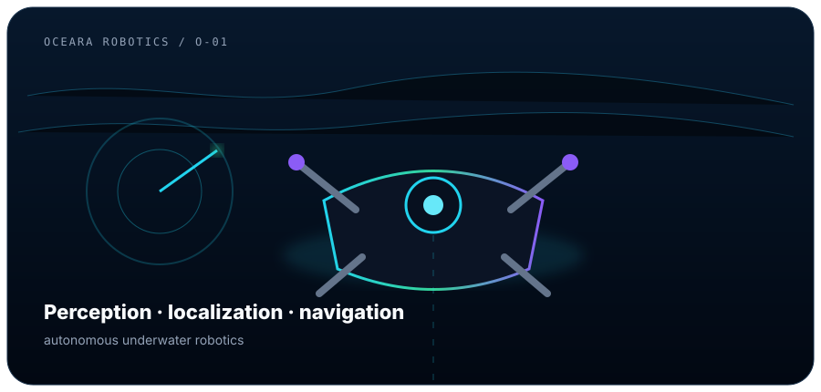

 

  

<table align="center">
<tr>
<td align="center"><b>9.74/10</b> GPA</td>
<td align="center"><b>2K+</b> GAINN signups</td>
<td align="center"><b>1K+</b> StoryLens signups</td>
<td align="center"><b>85%</b> evaluator detection</td>
<td align="center"><b>100K+</b> LHC-style samples</td>
</tr>
</table>

---

## Selected work

<table>
<tr>
<td width="50%" valign="top">

**RecoverIT** · AI-assisted payment recovery  
evidence · workflow state · verification · approval

</td>

<td width="50%" valign="top">

**GAINN** · multi-agent AI news platform  
research · drafting · quality control · 2K+ signups

</td>
</tr>

<tr>
<td width="50%" valign="top">

**StoryLens** · AI research-to-video  
research · source verification · script · animation · 1K+ signups

</td>

<td width="50%" valign="top">

**Oceara O-01** · autonomous underwater robotics  
perception · localization · navigation · mapping

</td>
</tr>
</table>

Real product visuals above · custom motion below · technical depth in the repositories.

---

## Research

**IDSIA / SUPSI** — multimodal data collection and augmentation for VLA / Imitation Learning.

**Scientific ML** — anomaly detection and signal analysis on simulated high-energy-physics data.

**AI reliability** — adversarial evaluation, LLM-as-a-Judge, multi-model workflows.

---

## Stack

<code>VLA</code> <code>Imitation Learning</code> <code>LLM-as-a-Judge</code> <code>Multi-Agent Systems</code> <code>Anomaly Detection</code> <code>REST APIs</code> <code>PostgreSQL</code>

---

---

<b>More projects</b>

 

**AI / Agents** — TeamForge · PortalPilot · AgentDate · Empath · Loop Closer · MindTussle

**Systems / Verification** — Strategy Reality · Contract Reality · EVE Healthcare API · Policy · Conditional Execution Vault

**ML / Data** — VISIONGUARD · Fast Particle Simulation ML · HEP Detector Signal Reconstruction · CineMatch · Keyword Extraction

**Product / Web3** — IP Aura · VeriChain Vault · VeriChain 3D ID · 1fi Marketplace · TaskFlow · Notice Board

→ [Browse all 51 repositories](https://github.com/Prakash-codeMaker?tab=repositories)

---

<a href="mailto:p9340297@gmail.com"><b>Research · engineering · collaboration →</b></a>

  

Bharati Vidyapeeth College of Engineering · Pune, India

  

