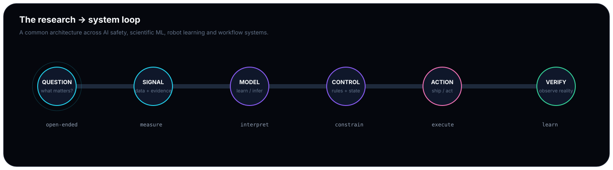
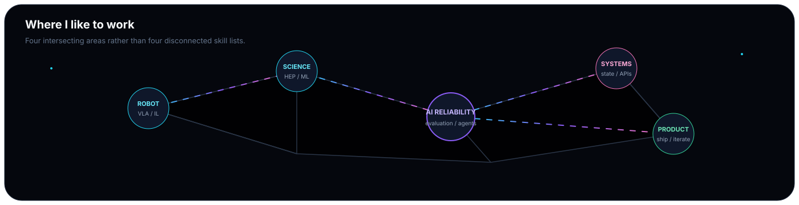

<!-- =========================================================
     PRAKASH CHAND JAIN — GitHub Profile
     Visual language: dark lab / research console / systems map
========================================================== -->

<p align="center">
  
</p>

<p align="center">
  <a href="https://github.com/Prakash-codeMaker">
    
  </a>
  <a href="https://www.linkedin.com/in/prakash-chand-jain-coder015675328/">
    
  </a>
  <a href="https://prakash-portfolio.vercel.app/">
    
  </a>
  <a href="mailto:p9340297@gmail.com">
    
  </a>
</p>

<p align="center">
  
</p>

---

## ◈ Profile

I'm **Prakash Chand Jain**, a second-year B.Tech Information Technology student at Bharati Vidyapeeth College of Engineering, Pune, with a **9.74 / 10 GPA**.

I like technical problems where the answer is not already obvious.

My usual loop:

```text
QUESTION
   ↓
SIGNAL / DATA
   ↓
EXPERIMENT
   ↓
MODEL / HEURISTIC
   ↓
DETERMINISTIC CONTROL
   ↓
SYSTEM / PRODUCT
   ↓
VERIFY IN REALITY
```

I work across **AI systems, research, scientific ML, backend engineering, and product development**.

<p align="center">
  
</p>

---

## ◉ A few signals

<table align="center">
<tr>
<td align="center" width="25%">

### 2K+

GAINN signups

</td>
<td align="center" width="25%">

### 1K+

StoryLens signups

</td>
<td align="center" width="25%">

### 85%

LLM evaluator detection accuracy

</td>
<td align="center" width="25%">

### 100K+

LHC-style samples

</td>
</tr>
<tr>
<td align="center">

### 40%

manual testing effort reduced

</td>
<td align="center">

### 9.74

GPA / 10

</td>
<td align="center">

### Top 50

ET GenAI Hackathon

</td>
<td align="center">

### 51

repositories

</td>
</tr>
</table>

---

## ⌁ Where the pieces connect

<p align="center">
  
</p>

I don't see these as separate interests.

**Robot learning** teaches me about data quality and multimodal behaviour.  
**Scientific ML** teaches me to reason about signals and anomalies.  
**AI reliability** forces me to think about evaluation, failure and trust.  
**Systems engineering** turns those ideas into durable software.  
**Product work** forces the system to survive contact with real users.

---

# 01 · Research

### Vision-Language-Action / Imitation Learning

At **IDSIA / SUPSI**, I researched multimodal demonstration-data collection and augmentation for **VLA and Imitation Learning** pipelines, with the goal of improving training-data quality and diversity.

The interesting part for me was the research process itself: the problem did not come with a single obvious playbook, so the work involved exploring alternatives and understanding downstream effects.

### Scientific ML

I built an anomaly-detection pipeline over **100,000+ simulated LHC-style samples** using:

```text
data
 ↓
preprocessing
 ↓
Autoencoder
 ↓
reconstruction error
        +
Isolation Forest
 ↓
anomaly score
 ↓
inspection dashboard
```

→ [LHC anomaly detection](https://github.com/Prakash-codeMaker/lhc-anomaly-detection)

---

# 02 · AI systems

### RecoverIT

An AI-assisted payment-recovery workflow designed around an explicit reliability boundary:

```text
messy evidence
      ↓
AI interpretation
      ↓
structured facts
      ↓
deterministic verification
      ↓
approval gate
      ↓
action
      ↓
monitor
      ↓
resolve / escalate
```

The core design principle is simple:

> **AI can interpret ambiguity. Deterministic software owns consequential state.**

Engineering themes include **state machines, evidence gates, retries, idempotency and auditable workflow state**.

→ [Repository](https://github.com/Prakash-codeMaker/RecoverIT) · [Live product](https://recoverit.hatchable.site)

### LLM Safety Evaluator

A FastAPI-based evaluation platform with Streamlit UI and multi-provider routing across GPT, Claude, DeepSeek and Gemini.

```text
adversarial prompts
        ↓
model responses
        ↓
LLM-as-a-Judge
        ↓
structured evaluation
        ↓
metrics
        ↓
PDF compliance report
```

→ [Repository](https://github.com/Prakash-codeMaker/llm-safety-evaluator)

### GAINN

A multi-agent AI news platform built and launched from scratch.

```text
research → drafting → quality control → user-facing product
```

**2,000+ signups.**

The important engineering idea was separating generation from quality control rather than treating a single model call as the whole system.

---

# 03 · Systems / infrastructure thinking

### TeamForge

A multi-phase benchmark for autonomous software engineering agents.

Instead of asking only:

> “Did the agent generate correct code?”

TeamForge asks:

```text
Can it plan?
Can it modify multiple files?
Can it run tests?
Can it respond to feedback?
Can it self-correct?
Can we reproduce and grade the process?
```

→ [Repository](https://github.com/Prakash-codeMaker/teamforge)

### PortalPilot

An operational workflow prototype built around:

```text
OBSERVE
  ↓
DETECT CHANGE
  ↓
FIND EVIDENCE
  ↓
VERIFY
  ↓
PREPARE
  ↓
HUMAN APPROVAL
  ↓
ACT
  ↓
RE-OBSERVE
  ↓
VERIFY OUTCOME
```

→ [Repository](https://github.com/Prakash-codeMaker/portalpilot)

### EVE Healthcare Diagnostic Booking API

A backend implementation covering authentication, diagnostics, booking state, simulated payments and an idempotent payment webhook.

Key engineering decisions included:

**JWT · PostgreSQL · layered API design · HMAC-SHA256 · transactions · row locking · idempotency**

→ [Repository](https://github.com/Prakash-codeMaker/eve-healthcare-diagnostic-booking-api)

---

# 04 · Product experiments

| Project | What I explored | Technical core |
|:--|:--|:--|
| **VISIONGUARD** | Explainable image-quality inspection | learned quality model · feature evidence · uncertainty |
| **StoryLens** | Research → narrative → animated video | multi-stage AI workflow |
| **CineMatch** | Explainable hybrid recommendations | TF-IDF · cosine similarity · SVD |
| **AgentDate** | Agent-to-agent compatibility | profile modelling · multi-turn agent interaction |
| **Strategy Reality** | Verification of intended vs observed strategies | policy identity · state · evidence · reality gap |
| **Contract Reality** | Continuous contract-to-event verification | deterministic rules · investigation workflows |
| **MindTussle** | Multimodal focus monitoring | vision analysis · browser extension |
| **Fast Particle Simulation ML** | ML surrogate for particle simulation | PyTorch · scientific approximation |

---

# ⟡ Engineering signatures

These are the ideas I find myself using again and again:

### Make state explicit

If a workflow matters, represent its state instead of reconstructing it from conversation history.

### Validate at boundaries

Bad input should fail near the edge of the system, not several layers later.

### Do not trust the client

Prices, permissions, state transitions and other important values should be derived or checked server-side.

### Design for retries

Networks retry. Browsers retry. Providers retry. Your API should survive that reality.

### Separate interpretation from authority

A model may suggest. A deterministic control layer should decide.

### Verify the outcome

A successful API response does not automatically mean the outside world changed correctly.

### Measure the failure modes

Accuracy is useful. Knowing **when and why the system is wrong** is often more useful.

---

# 🧰 Stack

### Languages

<p>

</p>

### AI / ML

<p>

&nbsp;


</p>

### Backend / systems

<p>

</p>

### Frontend / product

<p>

</p>

---

# ◌ Experience

### Research Intern — IDSIA / SUPSI
**Dec 2025 – Jan 2026**

Multimodal demonstration-data collection and augmentation for VLA and Imitation Learning pipelines. fileciteturn6file0L44-L47

### Penetration Tester — Ceeras Pvt. Ltd.
**Feb 2025 – May 2025**

Security assessments across internal and web systems; automated testing workflows that reduced manual testing effort by **40%**. fileciteturn6file0L49-L51

---

# ✦ Proof of work

<p align="center">
  <a href="https://github.com/Prakash-codeMaker/RecoverIT">
    
  </a>
  <a href="https://github.com/Prakash-codeMaker/visionguard">
    
  </a>
  <a href="https://github.com/Prakash-codeMaker/teamforge">
    
  </a>
  <a href="https://github.com/Prakash-codeMaker/llm-safety-evaluator">
    
  </a>
</p>

---

# 📈 GitHub telemetry

<p align="center">
  
  
</p>

<p align="center">
  
</p>

<p align="center">
  
</p>

---

# ⌘ Repository atlas

**Current account snapshot: 51 repositories — 44 public, 7 private.**

I use GitHub as a working lab, not just a portfolio. The public repositories span product prototypes, scientific ML, AI evaluation, backend systems, hackathon work, Web3, frontend experiments and research tooling.

### AI / research
[llm-safety-evaluator](https://github.com/Prakash-codeMaker/llm-safety-evaluator) · [visionguard](https://github.com/Prakash-codeMaker/visionguard) · [lhc-anomaly-detection](https://github.com/Prakash-codeMaker/lhc-anomaly-detection) · [fast-particle-simulation-ml](https://github.com/Prakash-codeMaker/fast-particle-simulation-ml) · [hep-detector-signal-reconstruction](https://github.com/Prakash-codeMaker/hep-detector-signal-reconstruction) · [keyword-extraction-eeml](https://github.com/Prakash-codeMaker/keyword-extraction-eeml)

### Agents / workflow systems
[RecoverIT](https://github.com/Prakash-codeMaker/RecoverIT) · [TeamForge](https://github.com/Prakash-codeMaker/teamforge) · [PortalPilot](https://github.com/Prakash-codeMaker/portalpilot) · [AgentDate](https://github.com/Prakash-codeMaker/AgentDate) · [MindTussle](https://github.com/Prakash-codeMaker/MindTussle) · [empath](https://github.com/Prakash-codeMaker/empath) · [loop-closer](https://github.com/Prakash-codeMaker/loop-closer)

### Product / full-stack
[Portfolio](https://github.com/Prakash-codeMaker/Portfolio) · [PCJ-Portfolio](https://github.com/Prakash-codeMaker/PCJ-Portfolio) · [TaskFlow](https://github.com/Prakash-codeMaker/taskflow) · [Notice-Board](https://github.com/Prakash-codeMaker/Notice-Board) · [online-appointment-booking](https://github.com/Prakash-codeMaker/online-appointment-booking) · [DETTROIN website](https://github.com/Prakash-codeMaker/DETTROIN-INT-Prakash-Chand-Jain-Website)

### Verification / systems prototypes
[Strategy Reality](https://github.com/Prakash-codeMaker/strategy-reality) · [Contract Reality](https://github.com/Prakash-codeMaker/contract-reality) · [policy](https://github.com/Prakash-codeMaker/policy) · [Conditional Execution Vault](https://github.com/Prakash-codeMaker/Conditional-Execution-Vault-CEV-) · [EVE Healthcare API](https://github.com/Prakash-codeMaker/eve-healthcare-diagnostic-booking-api)

### Web3 / blockchain
[IP Aura](https://github.com/Prakash-codeMaker/aptos-ip-aura) · [VeriChain Vault](https://github.com/Prakash-codeMaker/verichain-vault) · [VeriChain 3D ID](https://github.com/Prakash-codeMaker/verichain-3d-id) · [1fi Marketplace](https://github.com/Prakash-codeMaker/1fi-marketplace)

### Challenges / experiments
[Eonverse Screening Challenge](https://github.com/Prakash-codeMaker/Eonverse-Screening-Challenge) · [ISRO Challenge](https://github.com/Prakash-codeMaker/ISRO-Challenge) · [CineMatch](https://github.com/Prakash-codeMaker/-cinematch-recommender) · [Sorting Visualizer](https://github.com/Prakash-codeMaker/Sorting-Visualizer) · [Synrare AI](https://github.com/Prakash-codeMaker/Synrare-ai)

→ [View all repositories](https://github.com/Prakash-codeMaker?tab=repositories)

---

# ◇ Currently exploring

```text
01  Reliable agentic systems
02  AI evaluation + model reliability
03  Vision-Language-Action learning
04  Scientific machine learning
05  Human-in-the-loop automation
06  Backend systems with strong correctness guarantees
07  Research that can become a real product
```

---

# ∵ Beyond the screen

I care about the gap between a clever demo and a trustworthy system.

That gap usually contains the interesting engineering:

**failure modes · retries · evidence · race conditions · observability · state · human approval · evaluation**

That's where I want to spend more time.

---

<p align="center">
  <a href="mailto:p9340297@gmail.com"><b>Start a conversation</b></a>
  ·
  <a href="https://www.linkedin.com/in/prakash-chand-jain-coder015675328/"><b>LinkedIn</b></a>
  ·
  <a href="https://prakash-portfolio.vercel.app/"><b>Portfolio</b></a>
  ·
  <a href="https://github.com/Prakash-codeMaker"><b>GitHub</b></a>
</p>

<p align="center">
  
</p>

<p align="center">
  <sub>curiosity in · evidence out</sub>
</p>
