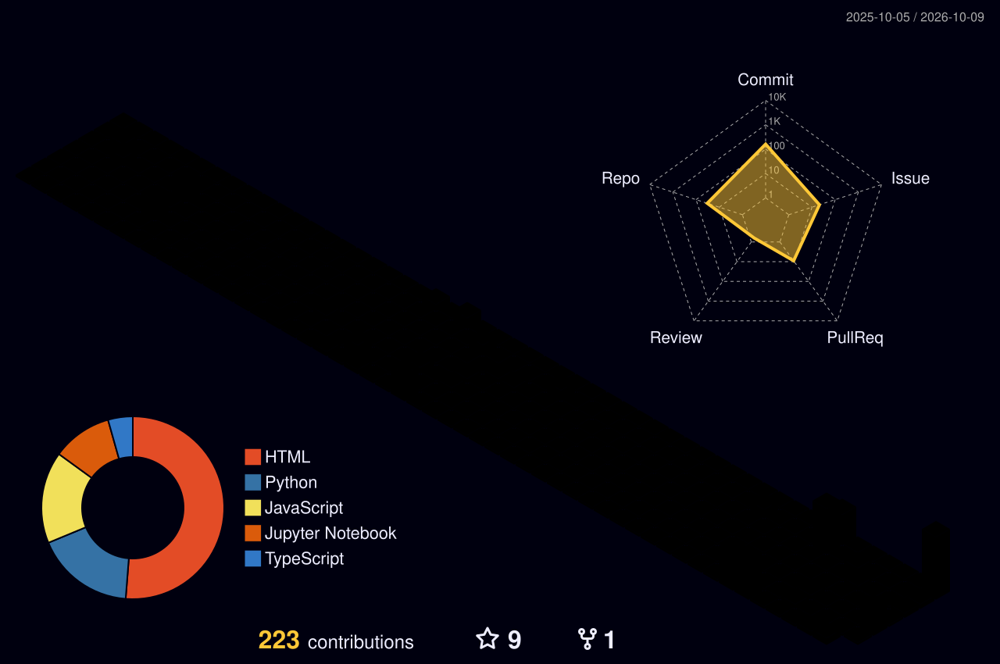

 

  

---

### 9.74 / 10 GPA · 2,000+ GAINN signups · 1,000+ StoryLens signups · 85% evaluator detection · 100K+ LHC-style samples

---

## 🧪 What I build

| | | |
|:---:|:---:|:---:|
| 🧠 **AI Systems** | 🔬 **Research** | ⚙️ **Reliable Software** |
| Agents · LLM eval · multimodal AI | VLA · imitation learning · scientific ML | APIs · workflows · state · verification |

  

---

## 🎞️ A few things I've shipped

<table>
<tr>
<td width="50%" valign="top">

**RecoverIT**  
AI-assisted payment recovery with evidence gates, deterministic workflow state, approval, retries and idempotency.

</td>

<td width="50%" valign="top">

**AI → control → action**  
A visual example of how I separate model interpretation from consequential system state.

</td>
</tr>

<tr>
<td valign="top">

**TeamForge**  
A multi-phase benchmark for autonomous software-engineering agents: planning, tool use, testing, self-correction and grading.

</td>

<td valign="top">

**VISIONGUARD**  
Learned image-quality inspection with uncertainty, evidence and anomaly localization.

</td>
</tr>
</table>

---

## 🧬 Research → system

**Robot learning** — multimodal demonstration data, VLA and imitation learning at IDSIA / SUPSI.  
**Scientific ML** — anomaly detection over 100,000+ simulated LHC-style samples.  
**AI reliability** — adversarial evaluation and LLM-as-a-Judge.  
**Systems** — durable workflows, verification, idempotency and auditable state.

---

## 🧭 Where the work connects

---

## ⚡ Selected work

<table>
<tr>
<td><b>GAINN</b> Multi-agent AI news platform 2,000+ signups</td>
<td><b>StoryLens</b> Research → video pipeline 1,000+ signups</td>
<td><b>LLM Safety Evaluator</b> Automated red-teaming 85% detection accuracy</td>
</tr>
<tr>
<td><b>LHC Anomaly Detection</b> Autoencoder + Isolation Forest 100K+ simulated samples</td>
<td><b>PortalPilot</b> Evidence → approval → action durable workflow prototype</td>
<td><b>TeamForge</b> Agent benchmark process-aware evaluation</td>
</tr>
</table>

---

## 🛠️ Stack

---

### 🐍 Contribution activity

---

## 📌 Proof of work

<a href="https://github.com/Prakash-codeMaker/RecoverIT">RecoverIT</a> ·
<a href="https://github.com/Prakash-codeMaker/visionguard">VISIONGUARD</a> ·
<a href="https://github.com/Prakash-codeMaker/teamforge">TeamForge</a> ·
<a href="https://github.com/Prakash-codeMaker/lhc-anomaly-detection">LHC Anomaly Detection</a> ·
<a href="https://github.com/Prakash-codeMaker/llm-safety-evaluator">LLM Safety Evaluator</a> ·
<a href="https://github.com/Prakash-codeMaker/eve-healthcare-diagnostic-booking-api">EVE Healthcare API</a> ·
<a href="https://github.com/Prakash-codeMaker/oceara-robotics">Oceara Robotics</a>

---

<b>Curious about hard problems.</b> Comfortable with messy ones.

