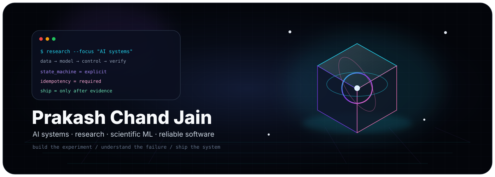

 

  

---

<table align="center">
<tr>
<td width="22%" align="center">

</td>
<td width="78%" valign="middle">

### Building at the intersection of **AI × research × systems**

<strong>9.74 GPA</strong> · <strong>2K+ GAINN</strong> · <strong>1K+ StoryLens</strong> · <strong>85% evaluator detection</strong> · <strong>100K+ LHC-style samples</strong>

  

Research Intern at <strong>IDSIA / SUPSI</strong> · Penetration Tester at <strong>Ceeras</strong>

</td>
</tr>
</table>

---

<table>
<tr>
<td width="50%">

</td>
<td width="50%">

</td>
</tr>
<tr>
<td width="50%">

</td>
<td width="50%">

</td>
</tr>
</table>

multi-agent AI · safety evaluation · scientific ML · underwater robotics

---

---

## 🧠 Stack

<code>VLA</code> · <code>Imitation Learning</code> · <code>LLM-as-a-Judge</code> · <code>Multi-Agent Systems</code> · <code>Anomaly Detection</code> · <code>REST APIs</code> · <code>PostgreSQL</code>

---

## 🚀 Work

<table>
<tr>
<td width="33%" valign="top" align="center">

### GAINN
<strong>Multi-agent AI news</strong>

Research → draft → QC → ship

<a href="https://github.com/Prakash-codeMaker">↗</a>

</td>

<td width="33%" valign="top" align="center">

### LLM Safety
<strong>Automated red-teaming</strong>

Adversarial prompts → judge → report

<a href="https://github.com/Prakash-codeMaker/llm-safety-evaluator">↗</a>

</td>

<td width="33%" valign="top" align="center">

### TeamForge
<strong>Agent benchmark</strong>

Plan → act → test → self-correct

<a href="https://github.com/Prakash-codeMaker/teamforge">↗</a>

</td>
</tr>

<tr>
<td valign="top" align="center">

### LHC ML
<strong>Scientific anomaly detection</strong>

100K+ samples · AE + IF

<a href="https://github.com/Prakash-codeMaker/lhc-anomaly-detection">↗</a>

</td>

<td valign="top" align="center">

### RecoverIT
<strong>AI + deterministic control</strong>

Evidence → verify → approve → act

<a href="https://github.com/Prakash-codeMaker/RecoverIT">↗</a>

</td>

<td valign="top" align="center">

### Oceara O-01
<strong>Underwater robotics</strong>

Perception · localization · navigation

<a href="https://github.com/Prakash-codeMaker/oceara-robotics">↗</a>

</td>
</tr>
</table>

---

---

## 🔬 Research

<strong>IDSIA / SUPSI</strong> — multimodal data collection + augmentation for VLA / Imitation Learning.

<strong>Scientific ML</strong> — anomaly detection + signal analysis on simulated high-energy-physics data.

<strong>AI reliability</strong> — adversarial evaluation + LLM-as-a-Judge.

---

---

<strong>Interpret ambiguity with models.</strong> 
<strong>Keep important state deterministic.</strong> 
<strong>Verify what actually happened.</strong>

---

<strong>⌁ More from the lab</strong>

 

Agents / automation → PortalPilot · AgentDate · Empath · Loop Closer · MindTussle

Verification / systems → Strategy Reality · Contract Reality · EVE Healthcare API · Policy · Conditional Execution Vault

ML / data → VISIONGUARD · Fast Particle Simulation ML · HEP Detector Signal Reconstruction · CineMatch · Keyword Extraction

Product / Web3 → IP Aura · VeriChain Vault · VeriChain 3D ID · 1fi Marketplace · TaskFlow · Notice Board

---

<a href="mailto:p9340297@gmail.com"><strong>Build something difficult with me →</strong></a>

  

  

