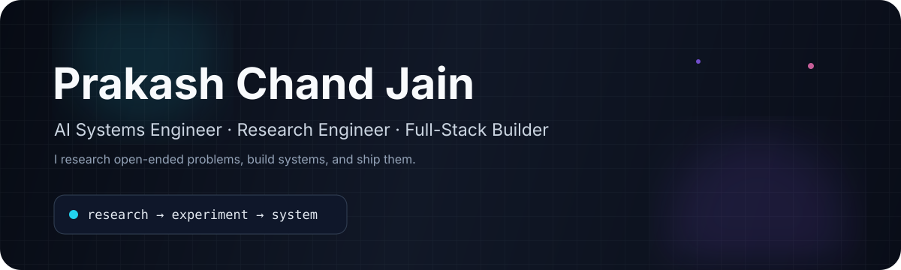
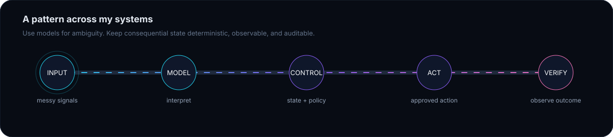
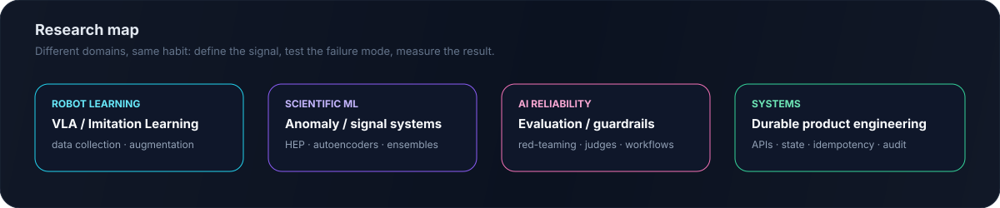

<!--
  Profile README
  Focus: AI systems • research • reliable software • products
-->

<p align="center">
  <a href="https://github.com/Prakash-codeMaker">
    
  </a>
</p>

<p align="center">
  <a href="https://github.com/Prakash-codeMaker">
    
  </a>
  <a href="https://www.linkedin.com/in/prakash-chand-jain-coder015675328/">
    
  </a>
  <a href="https://prakash-portfolio.vercel.app/">
    
  </a>
  <a href="mailto:p9340297@gmail.com">
    
  </a>
</p>

<p align="center">
  <b>Research → experiment → engineer → verify → ship.</b>
</p>

---

## 👋 About me

I'm **Prakash Chand Jain**, a second-year B.Tech Information Technology student at Bharati Vidyapeeth College of Engineering, Pune, with a **9.74 / 10 GPA**.

I work at the intersection of **AI systems, research, and software engineering**. I enjoy problems where the path is not already obvious: investigate the problem, build a measurable experiment, understand failure modes, turn the useful part into a reliable system, and ship it.

My strongest threads right now are:

- **AI systems:** multi-agent workflows, LLM evaluation, adversarial testing
- **Research:** multimodal data, VLA / imitation learning, scientific ML
- **Reliable software:** state machines, idempotency, verification, auditable workflows
- **Product engineering:** backend + full-stack systems that people can actually use

<p align="center">
  
</p>

---

## ⚡ Impact snapshot

| Signal | What it represents |
|:--|:--|
| **2,000+ signups** | GAINN — multi-agent AI news platform |
| **1,000+ signups** | StoryLens — AI research-to-video platform |
| **85% detection accuracy** | LLM Safety Evaluator on adversarial test prompts |
| **100,000+ samples** | LHC-style anomaly detection system |
| **40% less manual effort** | Security testing workflow automation at Ceeras |
| **9.74 / 10 GPA** | B.Tech Information Technology |
| **Top 50 / ~250k** | ET GenAI Hackathon |

---

## 🔬 Research map

<p align="center">
  
</p>

### Robot learning
At **IDSIA / SUPSI**, I researched multimodal demonstration-data collection and augmentation for **Vision-Language-Action (VLA)** and **Imitation Learning** pipelines, with a focus on training-data quality and diversity.

### Scientific ML
I built anomaly-detection and signal-analysis systems around simulated **high-energy-physics** data, including an Autoencoder + Isolation Forest ensemble over 100,000+ LHC-style samples.

### AI reliability
I built an LLM evaluation system with **LLM-as-a-Judge**, adversarial prompts, multi-provider routing, and automated compliance reporting.

### Systems
Across newer builds, I've become especially interested in **verification boundaries, durable state, idempotency, evidence, retries, and auditability** — especially when AI is involved.

---

## 🧠 A pattern I keep coming back to

> **Use AI where the input is ambiguous. Keep consequential state deterministic. Make every important transition observable.**

That usually becomes something like:

```text
messy input
    ↓
model / heuristic interpretation
    ↓
structured facts
    ↓
deterministic policy + state
    ↓
approved action
    ↓
observation
    ↓
verification
```

This is visible in projects such as **RecoverIT**, **PortalPilot**, **Strategy Reality**, and the **EVE Healthcare Booking API**.

---

## 🚀 Selected builds

### 01 · RecoverIT — AI-assisted payment recovery
**Live product · systems + AI reliability**

Turns messy payment problems and evidence into structured cases across verification, investigation, recovery routing, approval, monitoring, and resolution.

**Engineering ideas:** deterministic case states · evidence gates · retries · idempotency · auditable workflow state

→ [Repository](https://github.com/Prakash-codeMaker/RecoverIT) · [Live product](https://recoverit.hatchable.site)

---

### 02 · GAINN — Multi-agent AI news platform
**Live product · 2,000+ signups**

A multi-agent workflow that goes from research and drafting through automated quality control, with generation and QC responsibilities intentionally separated.

**Engineering ideas:** agent orchestration · structured outputs · verification · productization

> Built and launched from scratch; reached 2,000+ signups.

---

### 03 · LLM Safety Evaluator
**Research / evaluation infrastructure**

A FastAPI + Streamlit platform for automated red-teaming and evaluation across GPT, Claude, DeepSeek, and Gemini, using LLM-as-a-Judge scoring.

**Engineering ideas:** model routing · adversarial evaluation · repeatable test cases · automated compliance reports

→ [Repository](https://github.com/Prakash-codeMaker/llm-safety-evaluator)

---

### 04 · TeamForge — Benchmarking autonomous software engineering
**Research prototype · Hugging Face / OpenEnv**

A structured multi-phase benchmark for software-engineering agents. Instead of scoring only the final code, it evaluates planning, multi-file coordination, test execution, self-correction, and reflective improvement.

**Engineering ideas:** stateful environments · typed action/observation spaces · dense rewards · reproducibility · anti-exploit grading

→ [Repository](https://github.com/Prakash-codeMaker/teamforge)

---

### 05 · VISIONGUARD — Explainable image-quality inspection
**ML systems · deployed prototype**

A learned image-quality inspection pipeline that exposes evidence such as sharpness, exposure, noise, texture, clipping, uncertainty, and local anomalies instead of returning only a binary label.

**Engineering ideas:** feature engineering · learned heads · uncertainty · explainability · persisted analysis

→ [Repository](https://github.com/Prakash-codeMaker/visionguard)

---

### 06 · LHC anomaly detection
**Scientific ML · 100,000+ simulated samples**

An ensemble combining an **Autoencoder** and **Isolation Forest** to identify unusual events in simulated LHC-style collision data, with a React/TypeScript inspection dashboard.

**Engineering ideas:** unsupervised learning · reconstruction error · anomaly scoring · scientific visualization

→ [Repository](https://github.com/Prakash-codeMaker/lhc-anomaly-detection)

---

### 07 · PortalPilot / Strategy Reality
**Operational verification systems**

Two product prototypes exploring a similar systems question from different domains:

```text
intent
  ↓
observe change
  ↓
collect evidence
  ↓
verify
  ↓
prepare action
  ↓
human approval
  ↓
act
  ↓
re-observe
```

**Engineering ideas:** workflow state · evidence lineage · postcondition checks · approval gates · auditable transitions

→ [PortalPilot](https://github.com/Prakash-codeMaker/portalpilot) · [Strategy Reality](https://github.com/Prakash-codeMaker/strategy-reality)

---

### 08 · EVE Healthcare — Diagnostic Booking API
**Backend engineering · Django / DRF**

A backend assignment implementation for diagnostic centre discovery, booking, simulated payments, and an idempotent payment webhook.

**Engineering ideas:** layered API design · PostgreSQL relationships · JWT · transactions · HMAC-SHA256 · idempotency · row locking

→ [Repository](https://github.com/Prakash-codeMaker/eve-healthcare-diagnostic-booking-api)

---

## 🛠️ Engineering toolbox

### Languages
<p>
  
  
  
  
  
  
</p>

### AI / ML
<p>
  
  
  
  
  
</p>

### Backend / systems
<p>
  
  
  
  
  
  
  
  
</p>

### Frontend / product
<p>
  
  
  
  
  
</p>

---

## 🧩 Engineering principles

| Principle | In practice |
|:--|:--|
| **Make state explicit** | Prefer visible state machines over implicit behaviour |
| **Validate at boundaries** | Reject bad input before it reaches core logic |
| **Do not trust the client** | Derive sensitive values on the server |
| **Design for retries** | Idempotency matters whenever requests can be repeated |
| **Separate interpretation from authority** | AI can interpret; deterministic rules decide |
| **Verify outcomes** | “Request succeeded” is not the same as “the world changed” |
| **Make failures recoverable** | Preserve work and retry when dependencies fail |
| **Measure what matters** | Prefer concrete metrics over feature-counting |

---

## 📚 Experience

**Research Intern — IDSIA / SUPSI**  
Research on multimodal demonstration-data collection and augmentation for VLA and Imitation Learning pipelines.

**Penetration Tester — Ceeras Pvt. Ltd.**  
Security assessments across internal and web systems; automated testing workflows reduced manual effort by **40%**.

---

## 🏆 Highlights

- **Top 50 / ~250,000 participants** — ET GenAI Hackathon
- **Selected Delegate** — Harvard Project for Asian and International Relations (HPAIR)
- **GPA 9.74 / 10** — B.Tech Information Technology

---

## 📊 GitHub

<p align="center">
  
  
</p>

<p align="center">
  
</p>

---

## 🗂️ Repository map

I use GitHub for more than one kind of work — product prototypes, research code, backend systems, experiments, challenge submissions, and design-heavy builds.

**Current GitHub snapshot:** **51 repositories total · 46 public · 5 private**

### Product / systems
[RecoverIT](https://github.com/Prakash-codeMaker/RecoverIT) · [PortalPilot](https://github.com/Prakash-codeMaker/portalpilot) · [Strategy Reality](https://github.com/Prakash-codeMaker/strategy-reality) · [TeamForge](https://github.com/Prakash-codeMaker/teamforge) · [EVE Healthcare API](https://github.com/Prakash-codeMaker/eve-healthcare-diagnostic-booking-api)

### AI / ML
[llm-safety-evaluator](https://github.com/Prakash-codeMaker/llm-safety-evaluator) · [VISIONGUARD](https://github.com/Prakash-codeMaker/visionguard) · [LHC anomaly detection](https://github.com/Prakash-codeMaker/lhc-anomaly-detection) · [Fast particle simulation ML](https://github.com/Prakash-codeMaker/fast-particle-simulation-ml) · [CineMatch](https://github.com/Prakash-codeMaker/-cinematch-recommender)

### Applications / experiments
[MindTussle](https://github.com/Prakash-codeMaker/MindTussle) · [TaskFlow](https://github.com/Prakash-codeMaker/taskflow) · [AgentDate](https://github.com/Prakash-codeMaker/AgentDate) · [Notice Board](https://github.com/Prakash-codeMaker/Notice-Board) · [Sorting Visualizer](https://github.com/Prakash-codeMaker/Sorting-Visualizer)

### Web3 / product prototypes
[CEV](https://github.com/Prakash-codeMaker/Conditional-Execution-Vault-CEV-) · [IP Aura](https://github.com/Prakash-codeMaker/aptos-ip-aura) · [VeriChain](https://github.com/Prakash-codeMaker/verichain-vault) · [VeriChain 3D ID](https://github.com/Prakash-codeMaker/verichain-3d-id)

### Science / data
[HEP detector signal reconstruction](https://github.com/Prakash-codeMaker/hep-detector-signal-reconstruction) · [Keyword extraction](https://github.com/Prakash-codeMaker/keyword-extraction-eeml) · [Eonverse Screening Challenge](https://github.com/Prakash-codeMaker/Eonverse-Screening-Challenge)

→ [Browse all repositories](https://github.com/Prakash-codeMaker?tab=repositories)

---

## 🌱 What I'm exploring

- Reliable agentic systems
- AI evaluation and model reliability
- Scientific machine learning
- Vision-Language-Action systems
- Human-in-the-loop automation
- Backend systems with strong correctness guarantees
- Research problems that can become real products

---

## 🤝 Let's build

I'm especially interested in working with people building difficult things in:

**AI research · AI systems · developer tools · robotics · scientific computing · infrastructure · trustworthy automation**

<p align="center">
  <a href="mailto:p9340297@gmail.com"><b>Email</b></a>
  ·
  <a href="https://www.linkedin.com/in/prakash-chand-jain-coder015675328/"><b>LinkedIn</b></a>
  ·
  <a href="https://prakash-portfolio.vercel.app/"><b>Portfolio</b></a>
  ·
  <a href="https://github.com/Prakash-codeMaker"><b>GitHub</b></a>
</p>

<p align="center">
  <sub>Built with curiosity, measured with evidence, shipped with intent.</sub>
</p>
